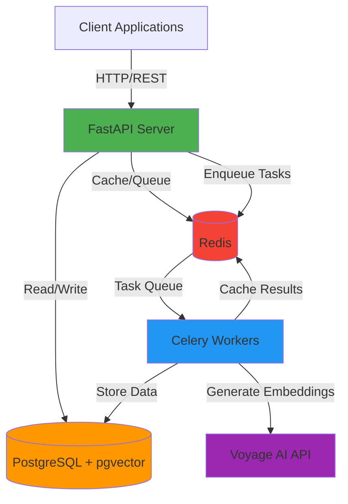
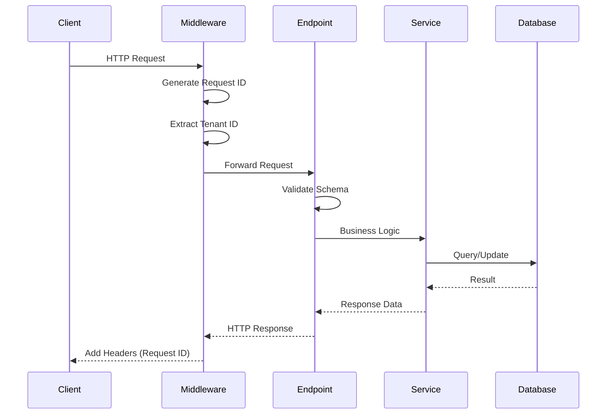
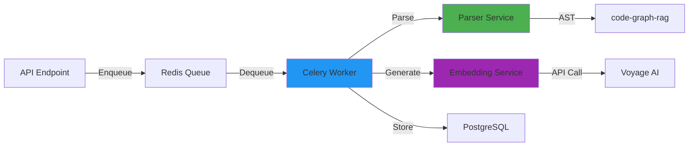
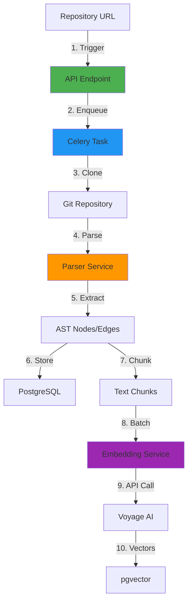
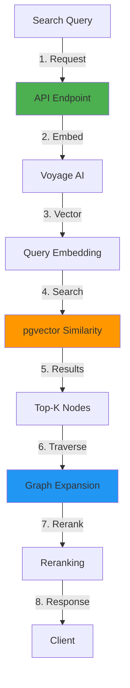
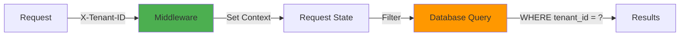

# Aelus-Aether Architecture

## System Overview

Aelus-Aether is a multi-tenant, multi-repository RAG (Retrieval-Augmented Generation) system designed for product intelligence and deep code understanding.



## Architecture Layers

### 1. API Layer (FastAPI)

**Responsibilities:**
- HTTP request handling
- Authentication & authorization
- Request validation (Pydantic)
- Response serialization
- Rate limiting
- Request ID tracking

**Key Components:**
- `app/main.py` - Application entry point
- `app/api/v1/` - API endpoints
- `app/middleware/` - Request middleware
- `app/schemas/` - Pydantic schemas

**Request Flow:**


### 2. Worker Layer (Celery)

**Responsibilities:**
- Asynchronous task processing
- Repository ingestion
- Code parsing
- Embedding generation
- Batch processing
- Retry logic

**Key Components:**
- `workers/celery_app.py` - Celery application
- `workers/tasks/ingestion.py` - Ingestion tasks
- `services/ingestion/` - Service layer

**Task Flow:**


### 3. Service Layer

**Responsibilities:**
- Business logic
- Data transformation
- External API integration
- Error handling

**Key Services:**

**Parser Service** (`services/ingestion/parser_service.py`):
- Repository parsing
- AST extraction
- Node/edge creation
- Multi-language support

**Embedding Service** (`services/ingestion/embedding_service.py`):
- Text chunking
- Batch embedding generation
- Rate limiting
- Retry logic

### 4. Storage Layer

**PostgreSQL with pgvector:**
- Relational data (tenants, repos, users)
- Graph data (code nodes, edges)
- Vector data (embeddings)
- Multi-tenant isolation

**Tables:**
```sql
-- Tenant Management
tenants
users

-- Repository Management
repositories

-- Code Graph
code_nodes
code_edges

-- Embeddings
code_embeddings (with pgvector)
```

**Redis:**
- Task queue (Celery broker)
- Result backend
- Application cache
- Rate limiting counters

## Data Flow

### Ingestion Pipeline



**Steps:**
1. **Trigger**: Client calls `/api/v1/ingest/repository`
2. **Enqueue**: Task queued in Redis
3. **Clone**: Worker clones repository
4. **Parse**: code-graph-rag parses files
5. **Extract**: Nodes and edges extracted
6. **Store**: Graph data stored in PostgreSQL
7. **Chunk**: Code chunked for embeddings
8. **Batch**: Chunks batched (up to 96 per request)
9. **API Call**: Voyage AI generates embeddings
10. **Vectors**: Embeddings stored in pgvector

### Retrieval Pipeline (Phase 4)



## Multi-Tenancy Architecture

### Tenant Isolation

**Database Level:**
- Row Level Security (RLS) policies
- Tenant ID in all tables
- Enforced at query level

**Application Level:**
- Tenant context in request state
- Automatic tenant filtering
- Quota enforcement

**Isolation Flow:**


### Tenant Context Propagation

```python
# 1. Middleware extracts tenant ID
tenant_id = request.headers.get("X-Tenant-ID")
request.state.tenant_id = tenant_id

# 2. Service layer uses tenant context
async def create_repository(tenant_id: str, data: dict):
    # All queries automatically filtered by tenant_id
    repository = Repository(tenant_id=tenant_id, **data)

# 3. Storage layer enforces isolation
async def query_graph(tenant_id: str, query: str):
    # SECURITY: Validates tenant_id in WHERE clause
    if "tenant_id" not in query.lower():
        raise StorageError("Query must include tenant_id filtering")
```

## Component Details

### 1. code-graph-rag Library

**Purpose**: Multi-language code parsing and graph extraction

**Supported Languages:**
- Python
- TypeScript/JavaScript
- Java
- C/C++
- Go
- Rust
- PHP
- Lua
- C#

**Features:**
- AST parsing with Tree-sitter
- Call graph extraction
- Import resolution
- Type inference
- Cross-file linking

### 2. FastAPI Application

**Configuration:**
- Async ASGI server (Uvicorn)
- Pydantic v2 for validation
- SQLAlchemy 2.0 (async)
- Structured logging (JSON)

**Middleware Stack:**
1. RequestIDMiddleware - Request tracking
2. CORS - Cross-origin requests
3. Compression - Response compression
4. Rate Limiting - Per-tenant limits

### 3. Celery Workers

**Configuration:**
- Broker: Redis (DB 0)
- Result Backend: Redis (DB 0)
- Pool: gevent (async support)
- Concurrency: 100 workers
- Retry: Exponential backoff

**Task Types:**
- `parse_and_index_file` - Single file processing
- `parse_and_index_repository` - Full repo processing (Phase 3)

### 4. PostgreSQL + pgvector

**Extensions:**
- pgvector - Vector similarity search
- pg_trgm - Fuzzy text search (future)

**Indexes:**
- B-tree on tenant_id, repo_id
- IVFFlat on embedding vectors
- GiST on qualified_name (future)

**Connection Pooling:**
- Min connections: 5
- Max connections: 20
- Pool timeout: 30s
- Async driver: asyncpg

### 5. Redis

**Databases:**
- DB 0: Celery queue
- DB 1: Application cache
- DB 2: Rate limiting

**Connection Pooling:**
- Max connections: 50
- Health checks: 30s interval
- Socket keepalive: enabled

## Security Architecture

### Authentication & Authorization

**Current (Phase 1):**
- API key based (X-Tenant-ID header)
- Tenant validation

**Future (Phase 2):**
- JWT tokens
- Role-based access control (RBAC)
- OAuth 2.0 integration

### Data Security

**At Rest:**
- PostgreSQL encryption (TDE)
- Encrypted backups

**In Transit:**
- HTTPS/TLS 1.3
- Encrypted Redis connections

**Application Level:**
- Input validation (Pydantic)
- SQL injection prevention (parameterized queries)
- XSS prevention (response sanitization)
- Rate limiting per tenant

### Audit Logging

**Request Tracking:**
- Unique request ID per request
- Tenant ID in all logs
- Structured JSON logging

**Log Fields:**
```json
{
  "timestamp": "2025-10-24T19:00:00Z",
  "level": "INFO",
  "request_id": "uuid-here",
  "tenant_id": "tenant-123",
  "message": "Request completed",
  "duration_ms": 150,
  "status_code": 200
}
```

## Scalability

### Horizontal Scaling

**API Servers:**
- Stateless design
- Load balancer ready
- Session-less

**Celery Workers:**
- Auto-scaling based on queue depth
- Multiple worker pools
- Task routing

### Vertical Scaling

**Database:**
- Connection pooling
- Query optimization
- Indexed searches

**Redis:**
- Pipelining
- Connection pooling
- Cluster mode (future)

### Performance Optimizations

**Caching Strategy:**
- L1: Application memory (future)
- L2: Redis cache
- L3: Database query cache

**Batch Processing:**
- Embedding generation (96 chunks/batch)
- Database inserts (bulk operations)
- Graph traversal (batch queries)

## Monitoring & Observability

### Health Checks

**Liveness** (`/health`):
- Application running
- No dependency checks

**Readiness** (`/readyz`):
- Database connectivity
- Redis connectivity
- Worker availability

### Metrics (Future)

- Request latency (p50, p95, p99)
- Task processing time
- Queue depth
- Error rates
- Tenant usage

### Logging

**Structured Logging:**
- JSON format
- Request ID correlation
- Tenant ID tracking
- Error stack traces

**Log Levels:**
- DEBUG: Development only
- INFO: Request/response
- WARNING: Recoverable errors
- ERROR: Unrecoverable errors
- CRITICAL: System failures

## Deployment Architecture

### Development

```
Docker Compose:
- PostgreSQL (port 5432)
- Redis (port 6379)
- API Server (port 8000)
- Celery Worker (1 instance)
```

### Production (Future)

```
Kubernetes:
- API Pods (3+ replicas)
- Worker Pods (5+ replicas)
- PostgreSQL (managed service)
- Redis (managed service)
- Load Balancer
- Ingress Controller
```

## Future Enhancements

### Phase 3: Multi-Repo
- Cross-repository linking
- API endpoint detection
- Frontend-backend mapping
- Monorepo support

### Phase 4: Retrieval
- Hybrid search (vector + graph)
- Reranking algorithms
- Query optimization
- Caching layer

### Phase 5: Intelligence
- Code change impact analysis
- Dependency tracking
- Security vulnerability detection
- Performance bottleneck identification

## Technology Stack Summary

| Component | Technology | Purpose |
|-----------|-----------|---------|
| API Framework | FastAPI | HTTP API server |
| Task Queue | Celery + Redis | Async processing |
| Database | PostgreSQL 15 | Relational + graph data |
| Vector Store | pgvector | Embedding storage |
| Cache | Redis | Caching + rate limiting |
| Code Parser | Tree-sitter | AST parsing |
| Embeddings | Voyage AI | Code embeddings |
| ORM | SQLAlchemy 2.0 | Database access |
| Validation | Pydantic v2 | Schema validation |
| Testing | pytest | Test framework |
| Linting | Ruff | Code quality |
| Type Checking | mypy | Static typing |

## References

- [FastAPI Documentation](https://fastapi.tiangolo.com/)
- [Celery Documentation](https://docs.celeryq.dev/)
- [pgvector Documentation](https://github.com/pgvector/pgvector)
- [Tree-sitter Documentation](https://tree-sitter.github.io/)
- [Voyage AI Documentation](https://www.voyageai.com/docs)
